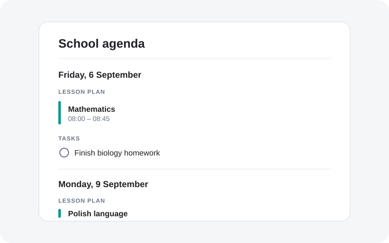

# School Agenda Card for Home Assistant

A fork of [Today Card](https://github.com/JonasDoebertin/ha-today-card) that combines school calendars, lesson plans and Home Assistant to-do lists in one Lovelace card.

<picture>
  <source media="(prefers-color-scheme: dark)" srcset="docs/preview-dark.svg">
  
</picture>

## Features

- Any number of regular calendar and `todo.*` entities.
- Mark selected calendar sources as **lesson plans**. Lesson plans are displayed separately from ordinary calendar events.
- Optional **next school day preview**. With the default Monday–Friday school week, Friday shows Friday's and Monday's lesson plans, plus calendar events and tasks from Friday through Monday. Monday shows Monday and Tuesday.
- Click a task to mark it complete through Home Assistant's `todo.update_item` service. A confirmation prompt is enabled by default and can be disabled in the card editor or YAML.
- Native visual editor, custom colors, date/time formatting and card tap actions inherited from Today Card.

## Installation

Install this repository as a custom **Dashboard** repository in HACS, then add `custom:today-card` to a dashboard. For manual installation, build the project and expose `dist/ha-today-card.js` from Home Assistant's `www` directory.

## Configuration

```yaml
type: custom:today-card
title: School agenda
show_next_school_day: true
confirm_todo_completion: false
# 0 = Sunday, 1 = Monday ... 6 = Saturday
school_days: [1, 2, 3, 4, 5]
entities:
  - entity: calendar.school_events
    color: blue
  - entity: calendar.lesson_plan
    color: teal
    school_schedule: true
todo_entities:
  - todo.homework
  - todo.school_projects
```

### Options

| Option | Default | Description |
| --- | --- | --- |
| `entities` | required | Calendar entities. Set `school_schedule: true` to identify a lesson-plan calendar. |
| `todo_entities` | `[]` | To-do entities (`todo.*`), as IDs or `{ entity, color }` objects. |
| `show_next_school_day` | `true` | Shows every day from the selected day through the next configured school day, and its lesson plan. Disable for a single-day card. |
| `school_days` | `[1,2,3,4,5]` | Weekday numbers used when finding the next school day. |
| `confirm_todo_completion` | `true` | Ask before completing a task after it is clicked. |
| `advance` | `0` | Starts the agenda this many days from today. |
| `show_all_day_events` | `true` | Include all-day calendar entries. |
| `show_past_events` | `false` | Include events already finished today. |
| `limit` | `0` | Per-section event limit; `0` means unlimited. |

## Credits

Based on Jonas Döbertin's Today Card and distributed under the original MIT license.

